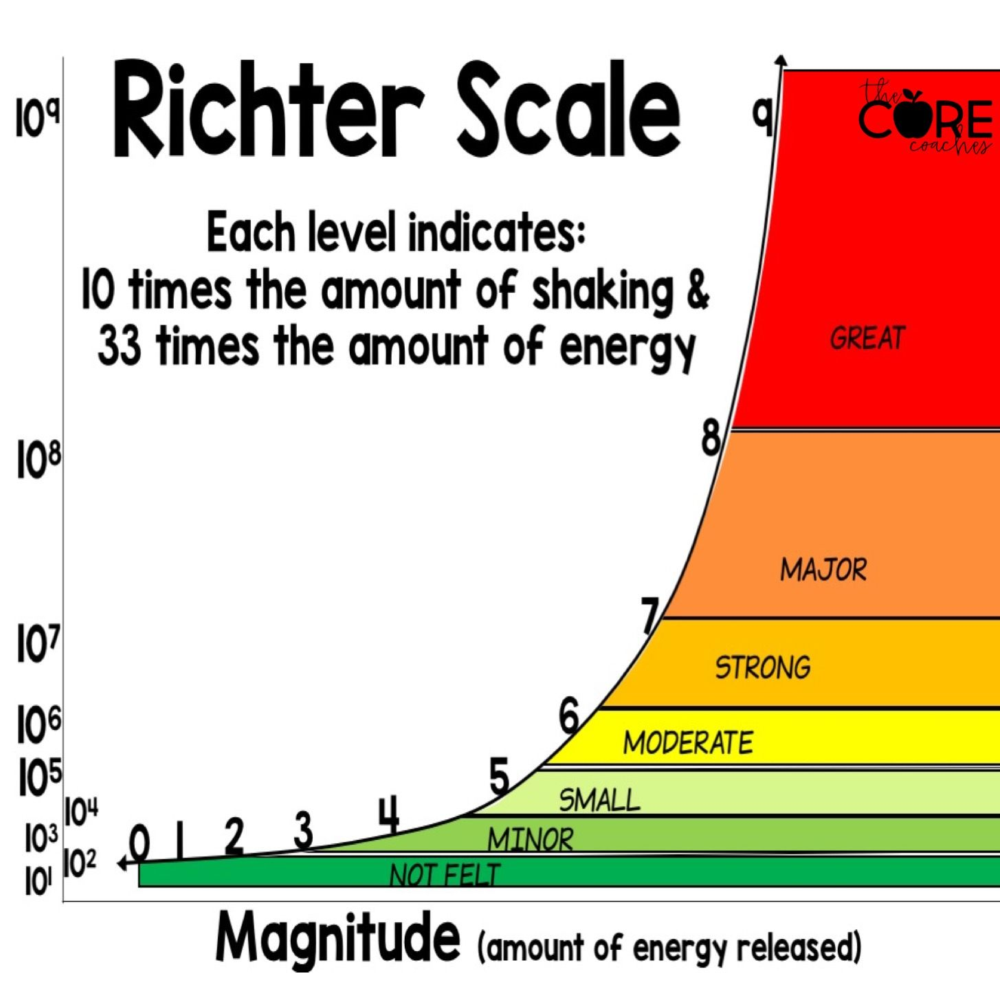

# Leaflet Homework: Visualizing Data with Leaflet

## Background

###1. Choose Data Set

The USGS provides earthquake data in a number of different formats, updated every 5 minutes. Visit the USGS GeoJSON Feed page and pick a data set to visualize.

Creator Notes: 
* The data chosen was all M1.0+ Earthquakes world-wide from the last week. M1.0 is more or less the minimum magnitude which we might feel an earthquake.

###2. Import & Visualize the Data

Create a map using Leaflet that plots all of the earthquakes from your data set based on their longitude and latitude.

*Your data markers should reflect the magnitude of the earthquake by their size and and depth of the earthquake by color. Earthquakes with higher magnitudes should appear larger and earthquakes with greater depth should appear darker in color.

*Include popups that provide additional information about the earthquake when a marker is clicked.

*Create a legend that will provide context for your map data.

Creator Notes:
* The legend for this maps has been based off of the following information from the USGS: Shallow earthquakes are between 0 and 70 km deep; intermediate earthquakes, 70 - 300 km deep; and deep earthquakes, 300 - 700 km deep

